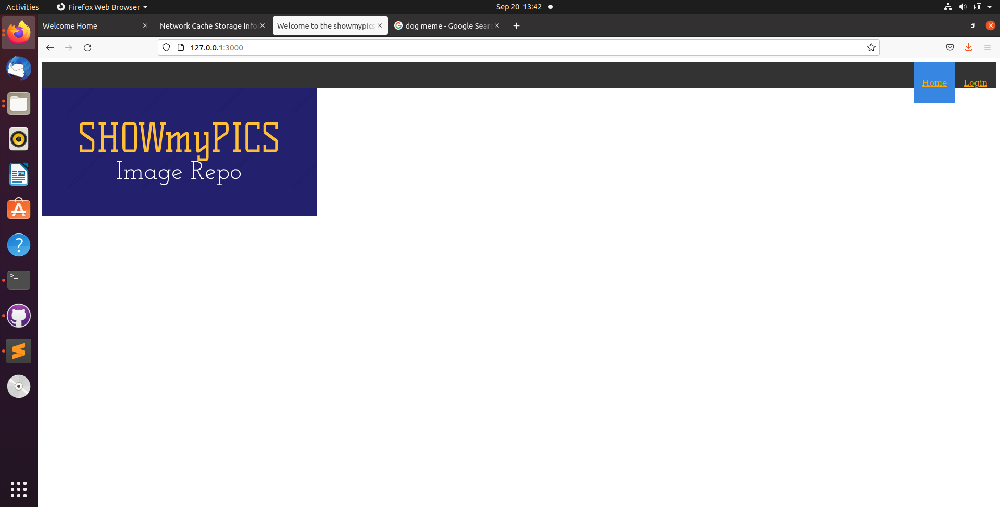
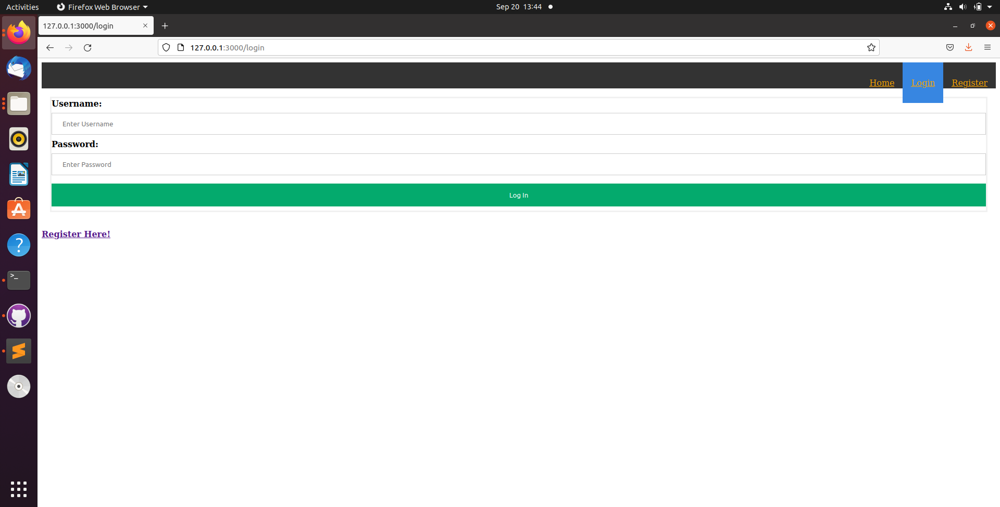
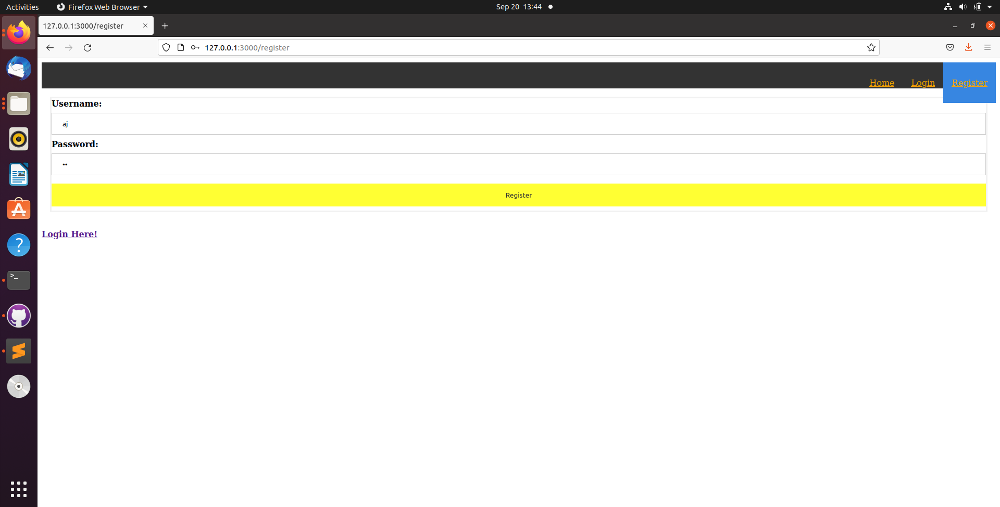
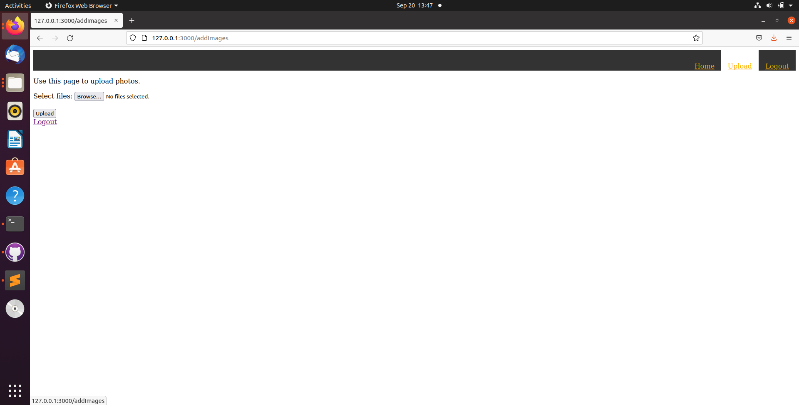
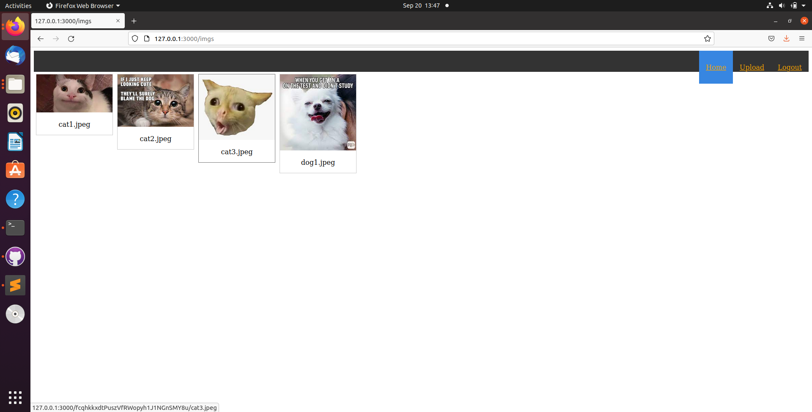

# showmypics - Image Repository
Welcome to the SHOWmyPICS repository. Below you can find everything you need to get started with the app.

## Screenshots
Homepage - 
Login Page - 
Registration page - 
Upload Page - 
Images page - 


## Dependencies
- mongodb - Database used for the application
- fs - File system manipulation
- body-parser - Used to parse json and for passport-local
- express-session - used by passport-local and also used to establish sessions with users
- uuid - used to configure passport securely
- mongoose - mongodb api
- passport - authentication library
- passport-local - local strategy for passport
- passport-local-mongoose - wrapper for passport-local and mongodb
- connectEnsureLogin - functions to see if user is logged in. Plugs into passport
- formidable - Library to parse forms including multiple file uploads
- hbs - handlebars templating engine
- keygen - generate keygen strings. Used to generate user folders
- ./user.js - Custom made user schema.

Setup
Note: This project was developed and tested on ubuntu 20.04.3 LTS

### Download and install mongodb community.
Start the service
```
sudo systemctl start mongod
```
From another tab, launch the shell
```
mongo
```
Create the users db from the mongo shell
```
use users
```

### Donwload the code and navigate to the folder it is located in and launch it in the terminal
```
npm init
```

### Install dependencies
```
npm install express
npm install express-session
npm install uuid
npm install passport
npm install connect-ensure-login
npm install formidable
npm install keygenerator
npm install mongoose
npm install passport-local-mongoose
npm install hbs
```

### Run the app
```
node app.js
```

The app will be running at localhost:3000

Note: This app is a WIP if there are any bugs feel free to report them here on Github.

Developer Notes:
TODO:
- Styleize the Upload page
- Fix the known bug when a user tries to register with an existing username
- Switch all path strings to use path.join
